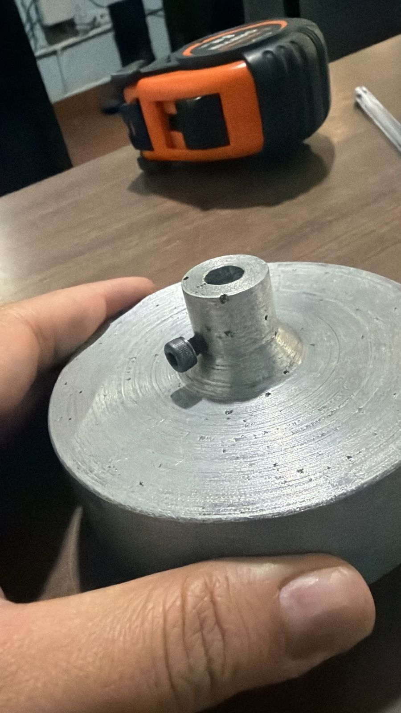
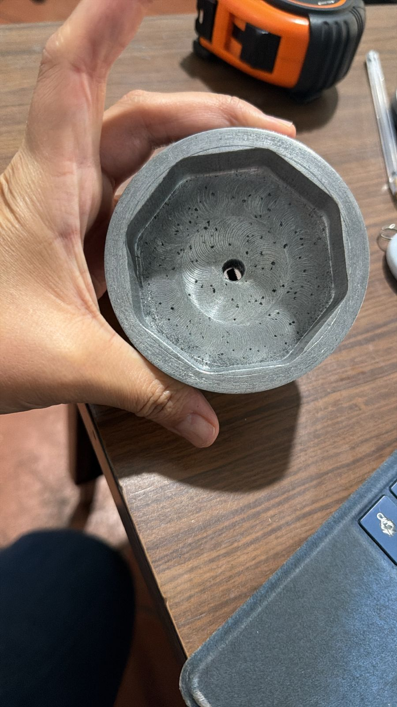
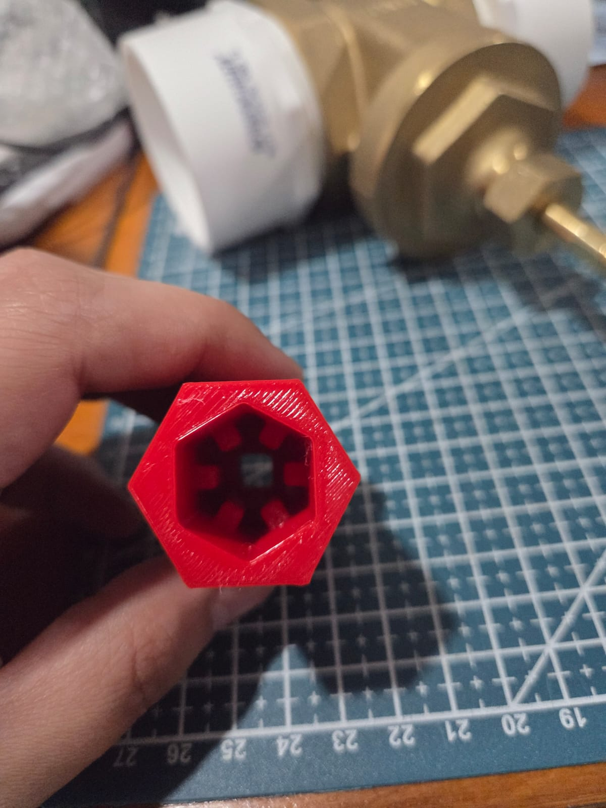
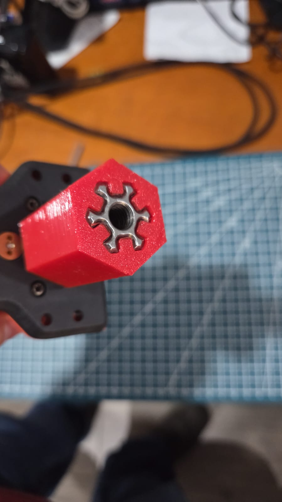

# DOKY — Remote Water Valve Automation System

> Electromechanical system developed to automate the opening and closing of existing water distribution valves through a remotely controlled actuator.

**Status:** Active development  
**Focus:** Mechanical Design · Rapid Prototyping · Additive Manufacturing · Embedded Systems · Field Testing

---

## Overview

DOKY is an electromechanical system developed to automate existing water distribution valves while adapting to infrastructure already installed in the field.

The project has been developed through an iterative engineering process:

**Design → Manufacture → Assemble → Field Test → Identify Problems → Redesign**

Three major mechanical iterations have been manufactured and evaluated, progressing from an initial proof of concept to a field-installed high-torque system.

---

## Engineering Challenge

The system had to be designed around existing water infrastructure rather than a standardized laboratory setup. This introduced several constraints:

- Existing valve and pipe geometry
- High torque required to operate the valve
- Limited installation space
- Exposure to water, mud and debris
- Protection of mechanical and electronic components
- Custom interfaces between the actuator and valve
- Rapid redesign between field tests

Field testing became a central part of the development process.

---

## Development Process

### V1 — Mechanical Proof of Concept

The first version was intentionally simple and was not intended to represent the final enclosure.

Its purpose was to evaluate the basic mechanical concept for actuating the valve. The system used a **NEMA 17 stepper motor** connected to a **custom cycloidal gearbox manufactured in PA6-CF** through FDM additive manufacturing.

This prototype established the initial mechanical basis for the project before developing a complete enclosure.

### V2 — First Complete Field Prototype

The second iteration introduced the first complete enclosure designed around the valve installation. The case used an elongated geometry with rounded corners and integrated the drive system into a complete assembly.

Custom **TPU gaskets** were designed and 3D printed to reduce water ingress between enclosure sections.

The prototype was installed on an actual valve to verify overall dimensions, mechanical fit, alignment, installation procedure and enclosure geometry.

The installation geometry was successfully validated, but field testing revealed a major limitation: the **NEMA 17 and reduction system did not provide sufficient torque to operate the valve**.

This result defined the main mechanical requirement for the next iteration.

### V3 — High-Torque Modular Design

The third iteration redesigned both the enclosure architecture and actuation system.

The enclosure was divided into functional modules referred to during development as **rings**, allowing different sections of the case to be designed around the components installed in each area.

Before field installation, the complete enclosure was assembled around a test pipe to verify fit and alignment between the different sections.

#### High-torque actuation

The previous drive system was replaced by a **DOCYKE 305 N·m actuator** incorporating a manufacturer-built planetary gearbox with metal gears.

A **custom metal coupling** was added between the actuator output and the valve to transmit the required torque.

  
  

<em>Custom machined coupling developed to transfer torque between the high-torque actuator and the existing valve.</em>

During field testing, the new actuator was able to **open and close the valve easily**, resolving the primary mechanical limitation identified in V2.

During installation, some enclosure joints required additional sealing, so epoxy putty was applied in the field as part of the prototype adaptation process.

---

## Mechanical Design

Mechanical development has included parametric CAD modeling, enclosure design, design for additive manufacturing, modular mechanical architecture, custom flexible seals, valve coupling development, mechanical component integration, iterative prototyping and field-driven redesign.

CAD development has been performed primarily using **Autodesk Fusion 360**.

---

## Additive Manufacturing

Additive manufacturing has been used extensively throughout DOKY because the mechanical design has continued to evolve between tests.

| Material | Application |
| --- | --- |
| **PA6-CF** | Cycloidal gearbox and mechanically demanding prototypes |
| **TPU** | Custom seals and experimental flexible coupling concepts |
| **Rigid FDM polymers** | Enclosures, mounting structures and prototype components |

The use of FDM manufacturing has allowed mechanical changes to move quickly from CAD to physical validation.

---

## Current Mechanical Development

Dense TPU prototypes are currently being evaluated to study the feasibility of a flexible coupling concept for a future mechanical iteration. These parts use a denser internal structure as proof-of-concept prototypes to evaluate whether TPU is suitable for the mechanical behavior required by the new concept.

  
  

<em>Experimental TPU coupling prototypes used for material and geometry evaluation.</em>

The final geometry and application of this concept remain under development and are intentionally not documented in detail at this stage.

---

## Electronics & Firmware

DOKY integrates an electronic control system based on the **ESP32 platform**.

The electronics and firmware have undergone multiple iterations through bench and field testing and are currently under active development.

Detailed PCB design files, schematics, Gerber files, firmware source code and detailed electrical architecture are intentionally not included in this public repository.

This repository focuses primarily on the **mechanical development, manufacturing process, system integration and field validation** of DOKY.

---

## Engineering Iterations

| Version | Main development | Result |
| --- | --- | --- |
| **V1** | NEMA 17 + custom PA6-CF cycloidal gearbox | Initial mechanical proof of concept |
| **V2** | Complete enclosure + custom TPU seals | Installation geometry validated; actuator torque insufficient |
| **V3** | Modular ring architecture + 305 N·m actuator + metal coupling | Successful valve actuation during field testing |
| **Current** | Mechanical material testing + continued electronics/firmware development | Active development |

---

## Project Contributions

My primary responsibility in DOKY has been the **mechanical development and manufacturing of the system**, including mechanical concept development, CAD design, enclosure development, design for additive manufacturing, material selection, prototype manufacturing, mechanical assembly, valve and actuator integration, field installation and testing, and iterative mechanical redesign.

The electronics and firmware are being developed collaboratively.

---

## Skills Demonstrated

Mechanical Design · Fusion 360 · DfAM · FDM/FFF · Rapid Prototyping · PA6-CF · TPU · ESP32 · Mechanical Integration · Field Testing · Iterative Design

---

## Project Status

🚧 **Active Development**

DOKY continues to evolve through laboratory and field testing. Additional public documentation will be added as development progresses.

---

### Daniel Andrés Oliva Salvatierra

Mechatronics Engineering · Digital Manufacturing · Rapid Prototyping

[GitHub Profile](https://github.com/daos59) · [Printables · @DAOS](https://www.printables.com/@DAOS)
